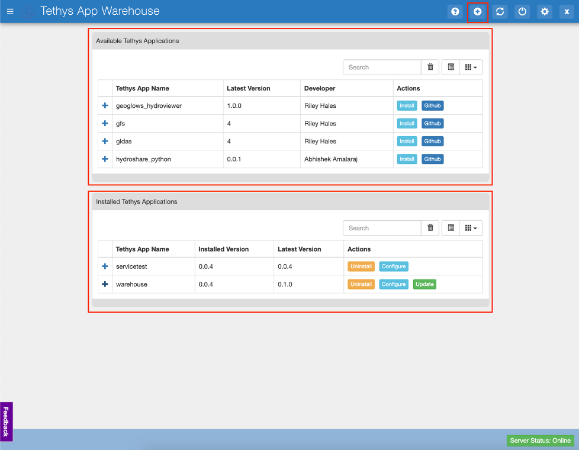
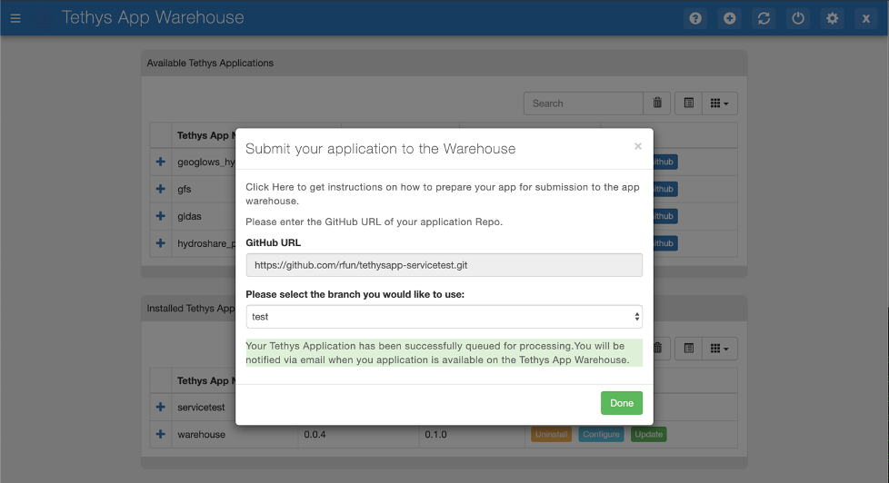

========================
Application Submission
========================

Before attempting to submit your application to the warehouse, ensure that your application fulfills the requirements for Tethys App Warehouse: 

- Application is compatible with Tethys 3+
- Application should run on Python 3.7+
- Cleanup old init files if the application was upgraded from an older Tethys 2 compatible version.: https://gist.github.com/rfun/ca38bb487ca1649be8491227adb7ca37

Application Metadata + setup.py
*******************************

The build process uses the setup.py file to pull the metadata for your application. The following fields are pulled from the setup.py and are displayed in the application warehouse: 

- Application name (Same as release package)
- Version
- Description
- Keywords
- Author Name
- Author Email
- URL
- License

It is recommended to fill in the values in your setup.py so that your application has those details visible in the warehouse for easier discovery and filtering. 

Each time you have a new version for your application, it is recommended to update the version number in your setup.py file so that a new package is built and published. 

Steps to Submit
***************

Developers can submit their applications to the warehouse by click on the Add App button as highlighted in the image below: 

Upon clicking that button, you will be presented with a modal that asks for the link to the GitHub Repository of your Tethys Application. 

- Enter the link to your GitHub Repository 
- If there are multiple branches on your GitHub repository, you will be presented with a list of branches on your GitHub repository, Select the branch that you would like to submit to the application warehouse. The warehouse uses the Master branch in case 
- After selecting the branch the warehouse begins the processing. Currently there isn't a good system to inform the user about the application submitted, but we are working on that. 